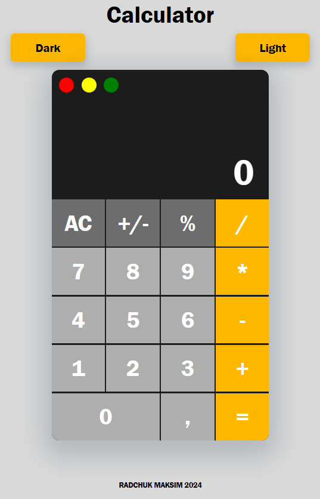

# Task: Simple Calculator
[Task](https://docs.google.com/document/d/1zpXXeSae-BlcxPKgw3DhxZA92cspVailrPYoaXSYrW8/edit?tab=t.0)


### Запуск Development сервера
<p>Чтобы запустить сервер для разработки, выполните команду:</p>

```json
"start": "webpack serve --open"
```
### Создание билда для production
<p>Чтобы выполнить production сборку, выполните команду:</p>

```json
"build:prod": "webpack --env  mode=production"
```

### Создание билда для development
<p>Чтобы выполнить development сборку, выполните команду:</p>

```json
"build:dev": "webpack --env  mode=development",
```
### pre-commit, 
будет выполняться перед каждым коммитом в Git.

```json
"pre-commit": "npm run lint -- --fix && npm run format",
```


## Структура проекта 

Этот проект имеет следующую структуру папок для организации файлов:

## `dist/`

Эта папка содержит 2 файла после build приложения: index.html и index.js

### `node_modules/`

Cодержит все зависимости проектаи. 


### `img/`

•  Содержит favicon.svg.


#### `src/`

•  Содержит статические файлы html и css.
•  Содержит файлы js.

#### `js/`

Эта папка соджит основной js код, распределенный по разным файлам js.


#### `eslint.config.mjs`

это файл конфигурации для ESLint.
 


### [Деплой приложения](https://gorgeous-salamander-2e3690.netlify.app/)


